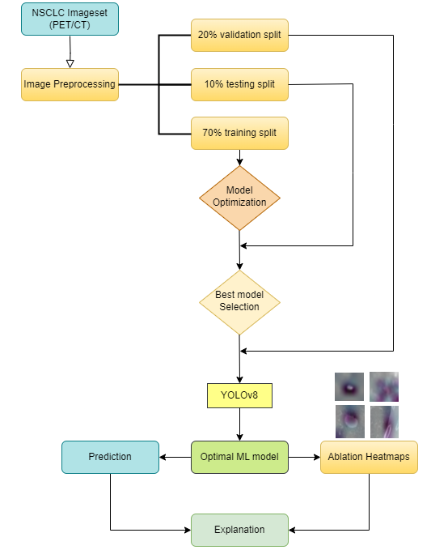
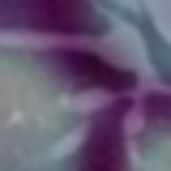
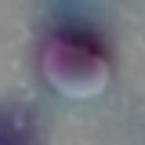

# EMERALD - ML
[](https://github.com/emeraldUTH/EMERALD-NSCLC-YOLO/)
[](README.md)
[](https://opensource.org/licenses/MIT)

This is the official <b>ML</b> implementation for NSCLC YOLOv8 classification work showcased on 
["Explainable YOLOv8 model for Solitary Pulmonary Nodules Classification using Positron Emission Tomography and Computed Tomography Scans"](to-be-updated).


## Paper Abstract
This study addresses the diagnostic challenges associated with Non-Small Cell Lung Cancer (NSCLC), the most prevalent form of lung cancer 
often diagnosed at advanced stages. It aims to develop a computer-aided classification model exclusively utilizing medical images from 
Positron Emission Tomography (PET) and Computed Tomography (CT) scans. The model identifies benign/malignant Solitary Pulmonary Nodules (SPN) 
related to NSCLC. A dataset comprising of 456 patients, in total, was curated, featuring 48.68% benign cases. To achieve its objective, four 
well-established Deep Learning (DL) algorithms were employed. The dataset was split into three different groups of images, each used for a 
particular task; training, testing and validation of the model. Notably, the study extends beyond predictive accuracy by delving into the 
prediction process of the best-performing model, thereby enhancing the explainability of the typically opaque Artificial Intelligence (AI) 
models. This explainability aspect aims to foster trust and confidence in the model's outcomes, allowing users to comprehend the 
decision-making process. The results indicate that the YOLOv8 algorithm emerged as the most accurate classification model, achieving a 
maximum accuracy of 91.3% and a maximum True Positive Rate (TPR) of 93.62%. This study’s importance lies in underscoring the potential of 
DL approaches in improving NSCLC diagnosis while providing a transparent and understandable classification mechanism. It offers a novel 
way of explaining classification results from YOLOv8 model and it demonstrates both the effectiveness of DL-assisted predictions in 
characterizing SPNs and the added value of interpretability, thereby offering a holistic perspective on the model's capabilities.


## Usage

The **NSCLC Classification Framework** leverages cutting-edge deep learning (DL) models to achieve highly accurate results in the classification of 
**Non-Small Cell Lung Cancer (NSCLC)**. This framework sets itself apart by utilizing state-of-the-art DL methods, such as **ResNet**, **MobileNet**, and **YOLOv8**, 
while focusing on both the accuracy of classification and the explainability of the prediction process.



### Key Features
- **Advanced DL Models**: The framework incorporates contemporary DL models like ResNet, MobileNet, and YOLOv8, ensuring top-tier accuracy in **NSCLC classification**. These models are trained on both clinical and image data, delivering robust predictive power.
- **Explainability for YOLOv8**: While DL models often act as black boxes, this framework adds an essential explainability layer, particularly for **YOLOv8**, the best-performing model. It provides insights into the decision-making process, a rarity in similar research, allowing users to understand why specific predictions are made.
- **Dataset and Performance**: The study employs a dataset consisting of **456 cases**, a substantial size that ensures reliability. The framework achieved peak performance, setting it apart from other models in this domain.
- **Transparency and Interpretability**: Beyond just prediction accuracy, this framework prioritizes **transparency**. By offering a deep dive into the black-box mechanics of YOLOv8, it allows for a clearer interpretation of the model’s decision-making process, enhancing the trustworthiness of the AI system.

### Example Interpretations
An example of the **YOLOv8 explainability** feature is shown below, where the framework visualizes the important areas contributing to the prediction:

**CT medical scans**
 

**PET medical scans**
 

### Contributions
1. **NSCLC classification without large datasets**: By using state-of-the-art DL models and a medium-sized dataset, this framework offers a more efficient approach to lung cancer classification, without requiring extensive image data.
2. **Comprehensive DL model evaluation**: The framework benchmarks the performance of four top-performing DL algorithms (ResNet, MobileNet, YOLOv8, etc.), using multiple metrics and ensuring a thorough analysis.
3. **Black-box model transparency**: This work tackles the often opaque nature of AI models, providing detailed explainability for the best-performing model, YOLOv8, and ensuring seamless integration into a computer-aided decision-making system for NSCLC diagnosis.

The **NSCLC Classification Framework** is perfect for researchers and medical professionals looking to incorporate **state-of-the-art DL models** into their diagnostic tools, while maintaining a high level of transparency and explainability in the results.

An example of usage for EMERALD-NSCLC-YOLO is shown below:

### Training

An example of the training process is provided in the `nsclc_vgg16.py` script. The `nsclc_vgg16.py` script can be used to train a DL
model given a set of training dataset. The `nsclc_vgg16.py` script can be used as follows:

```python
ct = f"F:/nsclc/Test3.v1/ct"
pet = f"F:/nsclc/Test3.v1/pet"

# Load custom dataset (replace 'data_dir' with your dataset directory)
data_dir = pet
image_datasets = {x: datasets.ImageFolder(root=f'{data_dir}/{x}', transform=data_transforms[x])
                  for x in ['train', 'test']}
dataloaders = {x: DataLoader(image_datasets[x], batch_size=32, shuffle=True, num_workers=4)
               for x in ['train', 'test']}

model = models.vgg16(pretrained=True)
num_classes = len(image_datasets['train'].classes)
model.classifier[6] = nn.Linear(model.classifier[6].in_features, num_classes)  # Modify the last FC layer

# Send the model to device
model = model.to(device)

# Define loss function and optimizer
criterion = nn.CrossEntropyLoss()
optimizer = SGD(model.parameters(), lr=0.001, momentum=0.9)

def train_model(model, criterion, optimizer, dataloaders, num_epochs=10):
# Training loop
    # num_epochs = 10
    for epoch in range(num_epochs):
        for phase in ['train', 'test']:
            if phase == 'train':
                model.train()
            else:
                model.eval()

            running_loss = 0.0
            all_preds = []
            all_labels = []

            for inputs, labels in dataloaders[phase]:
                inputs, labels = inputs.to(device), labels.to(device)

                # Zero the gradients
                optimizer.zero_grad()

                # Forward pass
                with torch.set_grad_enabled(phase == 'train'):
                    outputs = model(inputs)
                    loss = criterion(outputs, labels)

                    # Backpropagation and optimization only in training phase
                    if phase == 'train':
                        loss.backward()
                        optimizer.step()

                running_loss += loss.item() * inputs.size(0)
                _, preds = torch.max(outputs, 1)
                all_preds.extend(preds.cpu().numpy())
                all_labels.extend(labels.cpu().numpy())

            epoch_loss = running_loss / len(image_datasets[phase])
            epoch_accuracy = accuracy_score(all_labels, all_preds)

            print(f'Epoch {epoch + 1}/{num_epochs} [{phase}] Loss: {epoch_loss:.4f} Acc: {epoch_accuracy:.4f}')
```

It is recomended to save the trained model and subset using either the `save` function. For example:

```python
torch.save(model.state_dict(), 'vgg16_custom_dataset.pth')
```

### Ablation Heat-maps

An innovative approach for explaining YOLOv8 trained DL models can also be used. The `yolo_xai.py` script can be used to explain
the model stored by the YOLO training process. The `yolo_xai.py` script can be used as follows:

```python
yolo_model_path = 'F:/src/runs/classify/train8/weights/best.pt' # train7 -> ct, train8 -> pet
model = YOLO(yolo_model_path)

# Function to preprocess an image object
def preprocess_image(image, size=(640, 640)):
    transform = transforms.Compose([
        transforms.Resize(size),
        transforms.ToTensor()
    ])
    return transform(image).unsqueeze(0)

# Function for Feature Ablation
def feature_ablation(model, image, mask_size=60):
    original_tensor = preprocess_image(image)
    num_rows = (image.height + mask_size - 1) // mask_size
    num_cols = (image.width + mask_size - 1) // mask_size
    heatmap = np.zeros((num_rows, num_cols))

    # Perform inference on the original image
    with torch.no_grad():
        original_pred = model(original_tensor)
    original_confidence = original_pred[0].probs.top1conf.item()

    for i in range(0, image.width, mask_size):
        for j in range(0, image.height, mask_size):
            ablated_image = image.copy()
            draw = ImageDraw.Draw(ablated_image)
            draw.rectangle([i, j, i + mask_size, j + mask_size], fill="black")
            
            ablated_tensor = preprocess_image(ablated_image)
            with torch.no_grad():
                ablated_pred = model(ablated_tensor)
            ablated_confidence = ablated_pred[0].probs.top1conf.item()

            diff = np.abs(original_confidence - ablated_confidence)
            heatmap[j // mask_size, i // mask_size] = diff

    return heatmap
```
